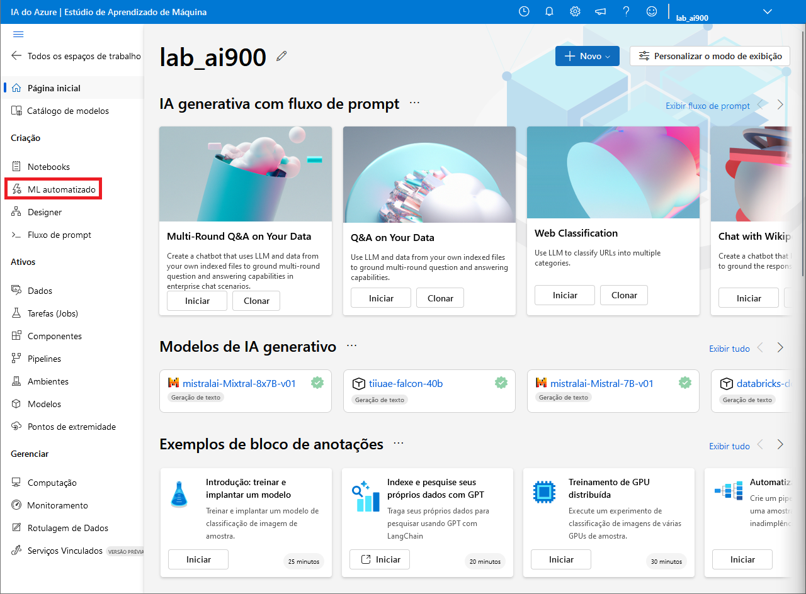
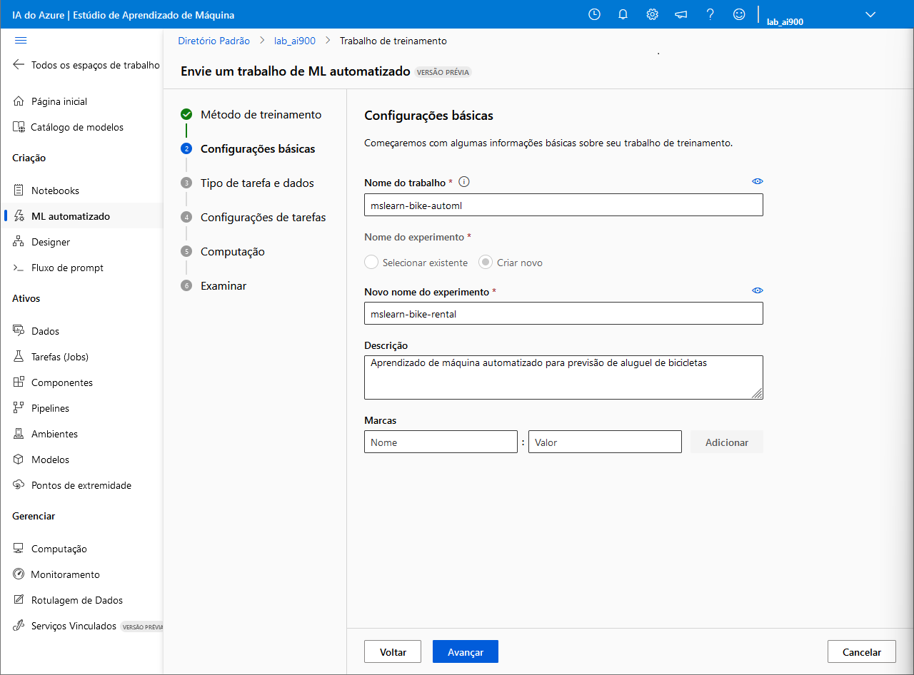
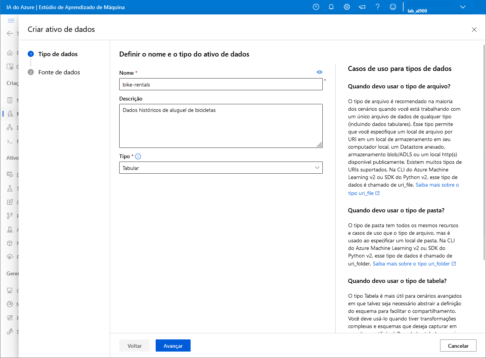
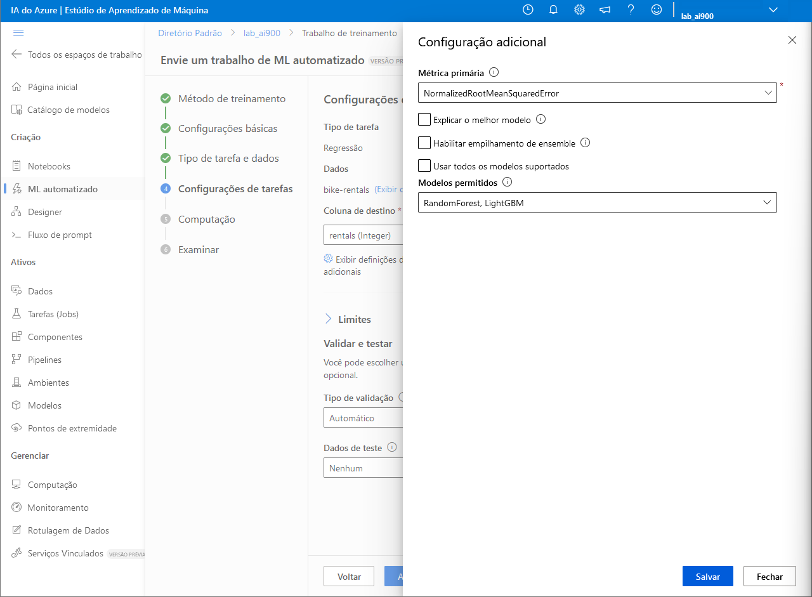
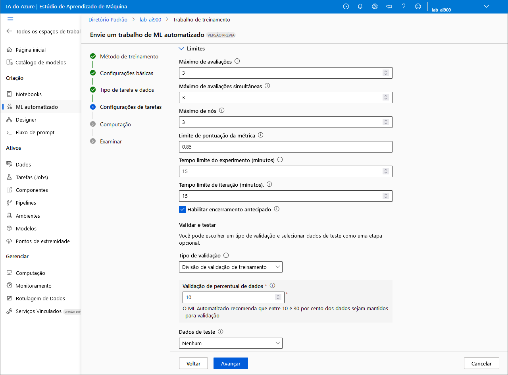
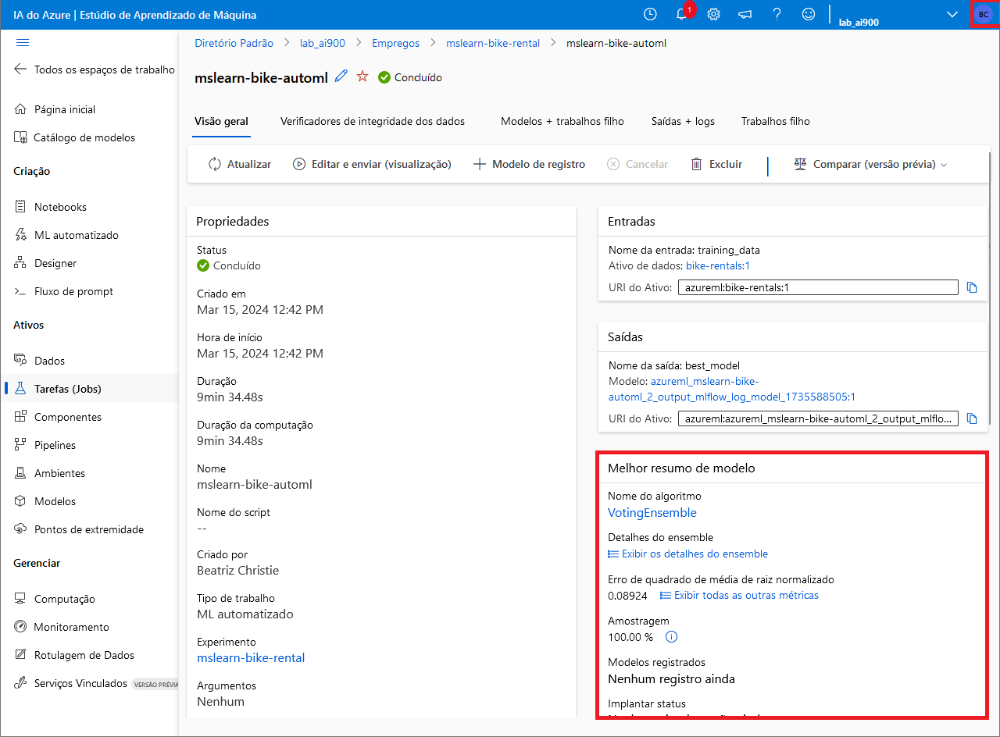
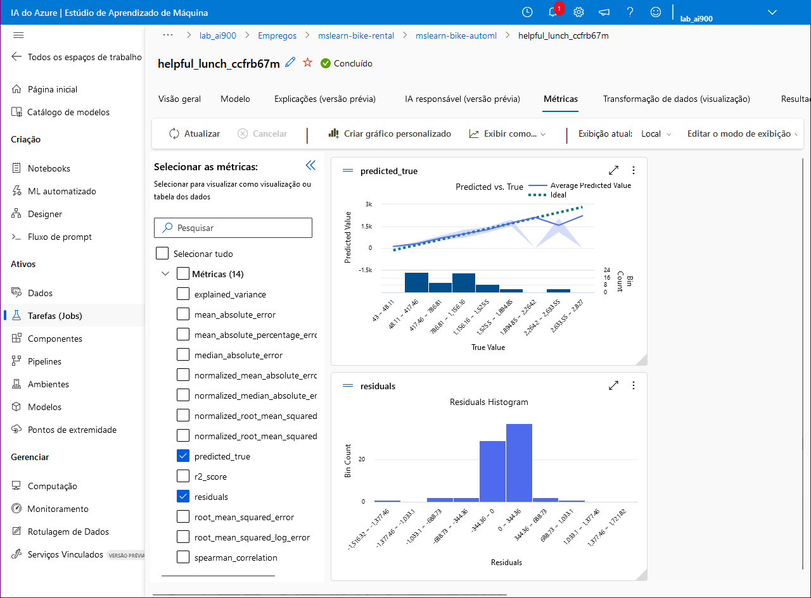
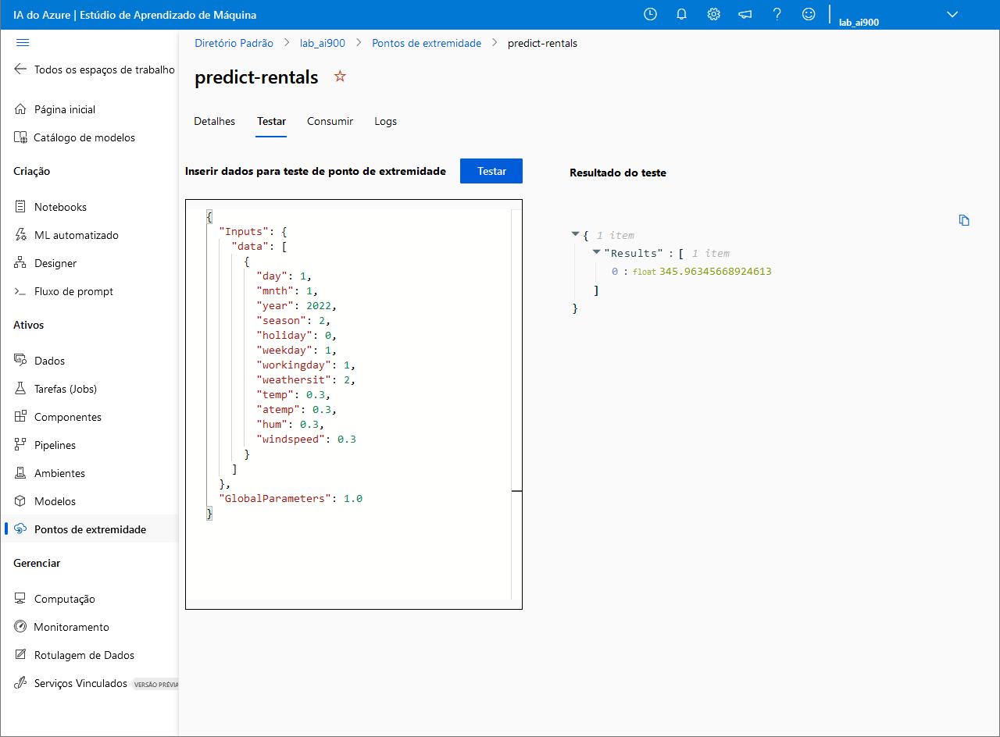

<h1 align="center">  🤖 Trabalhando com <i>Machine Learning</i> na Prática no Azure ML </h1>

 

Neste desafio, o recurso de aprendizado de máquina automatizado do Azure *Machine Learning* foi utilizado para treinar e avaliar um modelo de aprendizado de máquina.

Para usar o Azure *Machine Learning*, você precisa provisionar um espaço de trabalho na sua assinatura do Azure. Só assim você poderá usar o estúdio para trabalhar com os recursos em seu espaço de trabalho.

Caso ainda não possua um espaço de trabalho, siga as etapas do tópico [**Crie um espaço de trabalho do Azure *Machine Learning***](#ancora1). Caso contrário, siga para o tópico [**Use *machine learning* automatizado para treinar um modelo**](#ancora2).

 

## ✏️ Crie um espaço de trabalho do Azure *Machine Learning*

1. Faça *login* no [Portal Azure](https://portal.azure.com/) usando suas credenciais da Microsoft
2. Selecione **Criar um recurso** e busque por "***machine learning***".
3. Crie um novo recurso do Azure *Machine Learning* com as seguintes configurações:

    * **Assinatura** => *sua assinatura do Azure*
    * **Grupo de recursos** => *crie ou selecione um grupo de recursos*
    * **Nome** => *insira um nome exclusivo para o seu workspace*
    * **Região** => *selecione a região geográfica mais próxima*
    * **Conta de armazenamento** => *uma nova conta de armazenamento padrão será criada para o seu espaço de trabalho*
    * **Cofre de chaves** => *um novo cofre de chaves padrão será criado para o seu espaço de trabalho*
    * ***Application insights*** => *um novo recurso padrão de application insights será criado para o seu espaço de trabalho*
    * **Registro de contêiner** => *nenhum (será criado automaticamente na primeira vez que você implantar um modelo em um contêiner)*

4. Selecione **Examinar + criar** e, em seguida, selecione **Criar**. Aguarde a criação do seu espaço de trabalho (isso pode demorar alguns minutos) e, em seguida, vá para o recurso implantado.
5. Selecione **Iniciar o estúdio** (ou abra uma nova guia do navegador, navegue até https://ml.azure.com e entre no **Estúdio de Aprendizado de Máquina** usando sua conta da Microsoft). Feche todas as mensagens exibidas.

 

## ✏️ Use *machine learning* automatizado para treinar um modelo

1. No [Estúdio de Aprendizado de Máquina](https://ml.azure.com/?azure-portal=true), clique no tópico ML automatizado.

    

2. Crie um **Novo trabalho de ML Automatizado** com as seguintes configurações, usando **Avançar** sempre que necessário para progredir através da interface do usuário:

    * **Configurações básicas :**

        
        * **Nome do trabalho** : mslearn-bike-automl
        * **Novo nome do experimento** : mslearn-bike-rental
        * **Descrição** : Aprendizado de máquina automatizado para previsão de aluguel de bicicletas
        * **Marcas** : Nenhum

    * **Tipos de tarefa e dados:**
        * Selecionar tipo de tarefa : Regressão
        * Crie um novo conjunto de dados com as seguintes configurações:

            
            * Tipo de dados:
                * **Nome** : bike-rentals
                * **Descrição** : Dados históricos de aluguel de bicicletas
                * **Tipo** : Tabular
            * Fonte de dados : Selecione a partir de arquivos web
            * URL da Web: https://aka.ms/bike-rentals
            * Ignorar a validação de dados => *não selecione*
        
            * Configurações:
                * **Formato do arquivo** : Delimitado
                * **Delimitador** : Vírgula
                * **Codificação** : UTF-8
                * **Cabeçalhos de coluna** : Somente o primeiro arquivo tem cabeçalhos
                * **Ignorar linhas** : Nenhuma
                * **Conjunto de dados com dados de várias linhas** => *não selecione*

            * Esquema:

                * Inclua todas as colunas exceto **Path**

            Selecione **Criar**. Após a criação do conjunto de dados, selecione o conjunto de dados **bike-rentals** para continuar a enviar o trabalho ML Automatizado
    
    * **Configurações de tarefa**
        * **Tipo de tarefa** : Regressão
        * **Dados** : bike-rentals
        * **Coluna de destino** : rentals (Integer)
        * Exibir definições de configurações adicionais:

            
            * **Métrica primária** : NormalizedRootMeanSquaredError
            * Explicar o melhor modelo => *não selecione*
            * Habilitar empilhamento de ensemble => *não selecione*
            * Usar todos os modelos suportados => *não selecione*
            * Modelos permitidos => selecione apenas **RandomForest** e **LightGBM**

        * Limites => *expanda esta seção*

            
            * **Máximo de avaliações**: 3
            * **Máximo de avaliações simultâneas**: 3
            * **Máximo de nós**: 3
            * **Limite de pontuação da métrica**: 0,085
            * **Tempo limite do experimento (minutos)** : 15
            * **Tempo limite de iteração (minutos)** : 15
            * **Habilitar encerramento antecipado** => *selecione*
        
        * Validar e testar:

            * **Tipo de validação** : Divisão de validação de treinamento
            * **Validação de percentual de dados**: 10
            * **Dados de teste** : Nenhum

        * Computação :

            * **Selecione o tipo de computação** : Sem servidor
            * **Tipo de máquina virtual**: CPU
            * **Nível da máquina virtual**: Dedicado
            * **Tamanho da máquina virtual** : Standard_DS3_V2
            * **Número de instâncias**: 1

    Envie o trabalho de treinamento e espere que o trabalho termine. Isso pode demorar um pouco.

 

## ✏️ O melhor modelo

1. Na guia **Visão geral** do ML automatizado recém-criado, clique no texto sob **Nome do algoritmo** indicado no quadro **Melhor resumo de modelo** à direita para visualizar os detalhes.
    

2. Selecione a guia **Métricas** e selecione os gráficos de ***residuals*** e ***predict_true*** se ainda não estiverem selecionados.
    
 

## ✏️ Implante e teste o modelo

1. Na guia **Modelo** do ML automatizado recém-criado, selecione **Implantar** e use a opção **Serviço Web** para implantar o modelo com as seguintes configurações:
    
    * **Nome** : predict-rentals
    * **Descrição** : Prevê ciclos de aluguéis
    * **Tipo de computação** : Instância de contêiner do Azure
    * **Habilitar autenticação** => *selecione*

2. Aguarde o início da implantação - isso pode levar alguns segundos. O *status* para o *endpoint* **predict-rentals** será indicado na parte principal da página como **Em execução**.
Aguarde que o *status* mude para **Concluído**. Isso pode levar de 5 a 10 minutos.

 

## ✏️ Teste o serviço

1. No Estúdio de Aprendizado de Máquina, no menu esquerdo, selecione **Pontos de extremidade** e abra o ponto de extremidade **predict-rentals**.
2. Na aba **Testar**, insira os seguintes dados no quadro correspondente:

        {
            "Inputs": { 
                "data": [
                    {
                        "day": 1,
                        "mnth": 1,   
                        "year": 2022,
                        "season": 2,
                        "holiday": 0,
                        "weekday": 1,
                        "workingday": 1,
                        "weathersit": 2, 
                        "temp": 0.3, 
                        "atemp": 0.3,
                        "hum": 0.3,
                        "windspeed": 0.3 
                    }
                ]    
            },   
            "GlobalParameters": 1.0
        }

3. Clique no botão **Testar**. Analise os resultados do teste, que incluem um número previsto de locações baseado nos dados de entrada.

 

## ✏️ Limpeza

O serviço Web que você criou está hospedado em uma instância de contêiner do Azure. Se você não pretende reutilizá-lo, você deve excluir o *endpoint* para evitar o acúmulo de uso desnecessário do Azure.

1. No **Estúdio de Aprendizado de Máquina**, na guia **Pontos de extremidade**, selecione o ponto de extremidade **predict-rent**. Em seguida, selecione **Excluir** e confirme que você deseja excluir o *endpoint*.