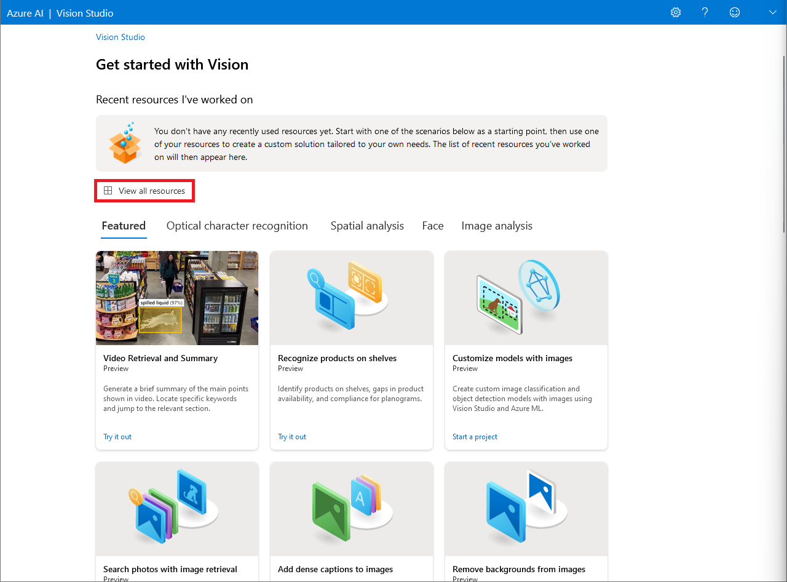
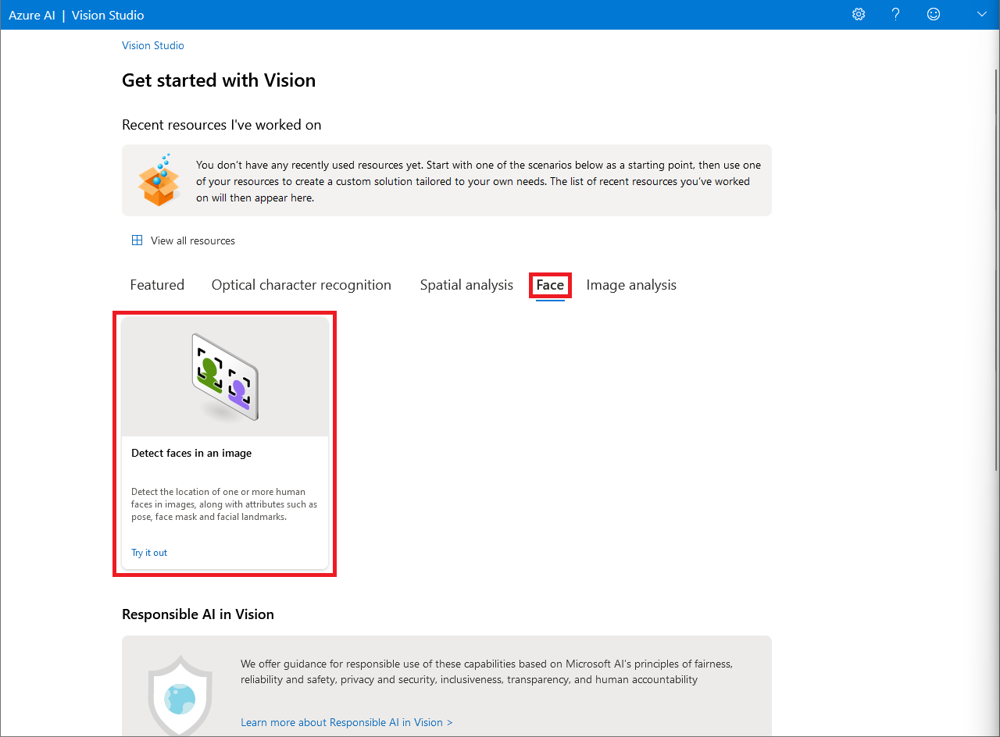
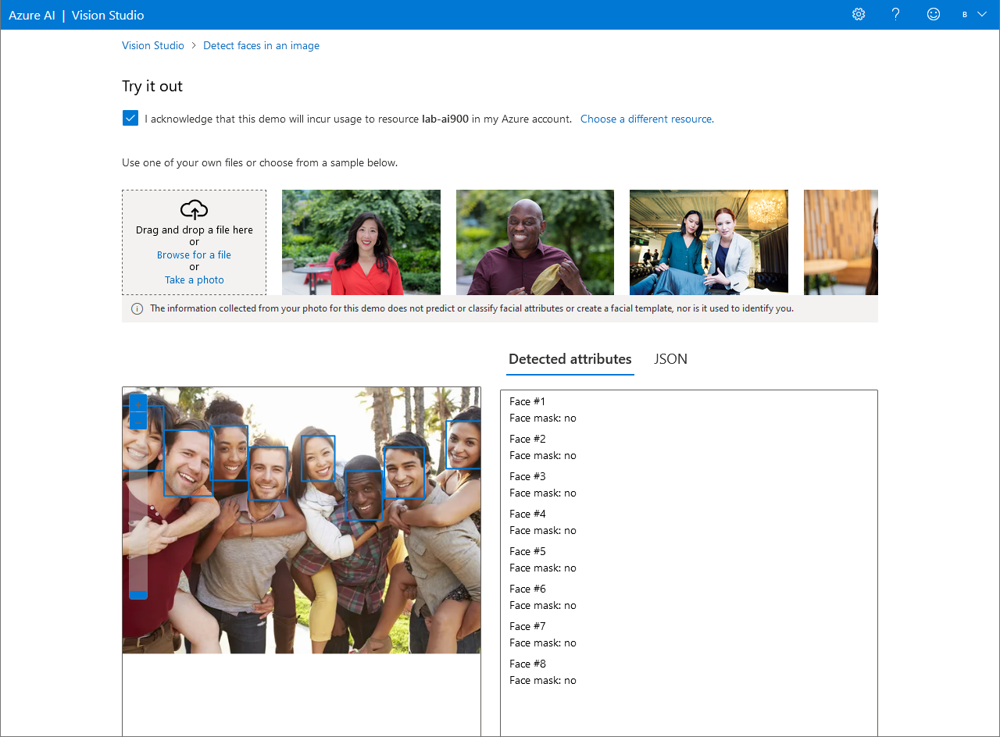
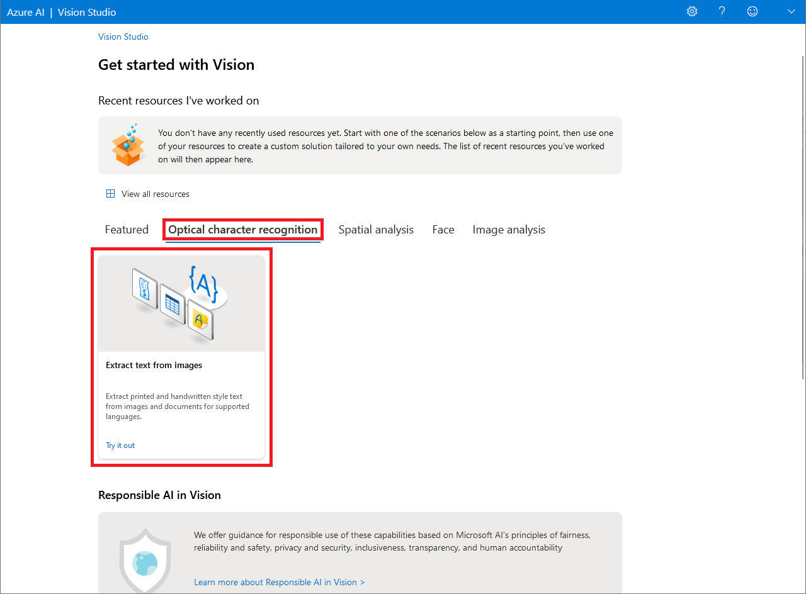
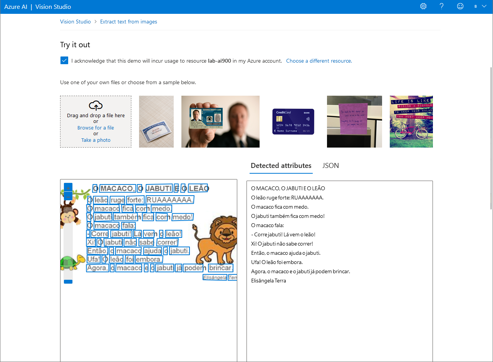
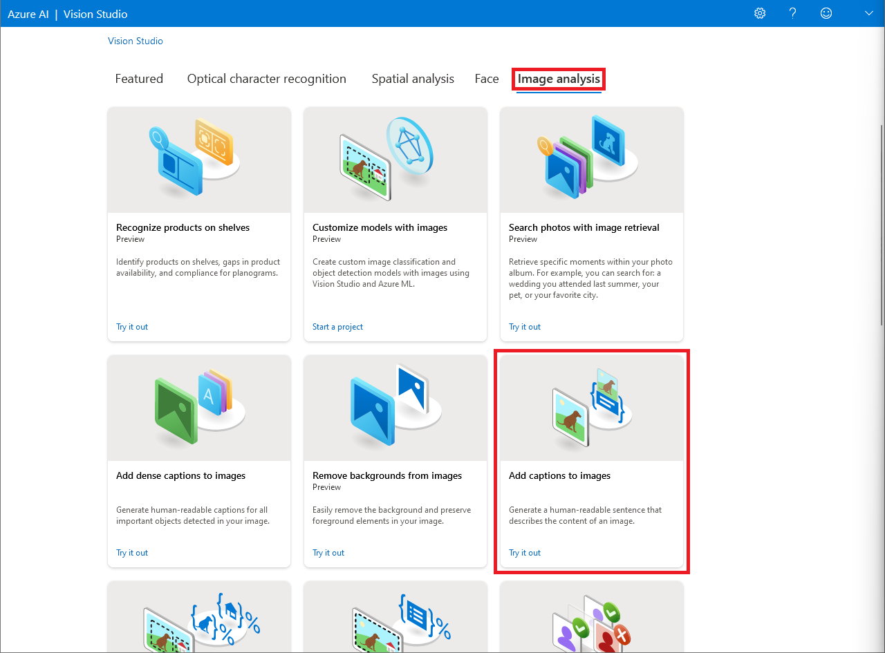
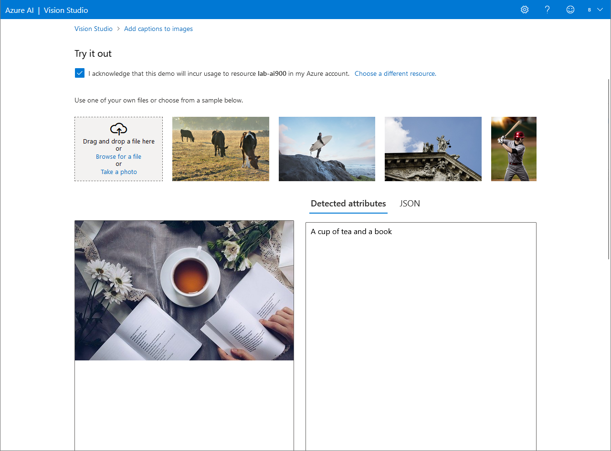

<h1 align="center">  🤖 Reconhecimento Facial e Transformação de Imagens em Dados no Azure ML </h1>

 

Neste desafio, o recurso de aprendizado de máquina automatizado do Azure *Machine Learning* foi utilizado para treinar e avaliar um modelo de aprendizado de máquina.

Para usar o Azure *Machine Learning*, você precisa provisionar um espaço de trabalho na sua assinatura do Azure. Só assim você poderá usar o estúdio para trabalhar com os recursos em seu espaço de trabalho.

Caso ainda não possua um espaço de trabalho, siga as etapas do tópico [**Crie um recurso do Azure AI *Services***](#ancora1). Caso contrário, siga para o tópico [**Conecte seu recurso Azure AI *Service* ao Vision Studio**](#ancora2).

 

## ✏️ Crie um recurso do Azure AI *Services*

1. Faça *login* no [Portal Azure](https://portal.azure.com/), usando suas credenciais da Microsoft
2. Selecione **Criar um recurso**, categoria IA + *Machine Learning* e busque por "**Serviços Cognitivos**".
3. Crie um novo recurso do Azure com as seguintes configurações:

    * **Assinatura** => *sua assinatura do Azure*
    * **Grupo de recursos** => *crie ou selecione um grupo de recursos*
    * **Região** => *selecione a região geográfica mais próxima*
    * **Nome** => *insira um nome exclusivo para o seu serviço*
    * **Tipo de preço** => Standard S0
    * **Ao marcar essa caixa, confirmo que li e compreendi todos os termos abaixo** => *selecione*

4. Selecione **Examinar + criar** e, em seguida, selecione **Criar**.

 

## ✏️ Conecte seu recurso Azure AI *Service* ao Vision Studio

1. Navegue até o [Vision Studio](https://portal.vision.cognitive.azure.com) e conecte-se usando as suas credenciais da Microsoft.

2. Na página inicial do Vision Studio, clique em **View all resources**

    

3. Em **Select a resource to work with**, selecione o serviço criado anteriormente e clique em **Select as default resource**
4. Feche a página ao clicar no "x" no canto superior direito.

 

## ✏️ Detecte rostos no Vision Studio

1. Na página inicial do Vision Studio, clique na aba **Face** e selecione o cartão **Detect faces in an image**.
    

2. Sob o subtítulo **Try It Out**, leia e aceite a política de uso de recursos.

3. Selecione cada uma das imagens amostras e observe os dados de detecção de rosto que são retornados.

4. Você também pode tentar com algumas de suas próprias imagens. Basta fazer o *upload* da imagem em **Browse for a file**. Veja o exemplo:
    

## ✏️ Leia texto no Vision Studio

1. Na página inicial do Vision Studio, clique na aba **Optical character recognition** e selecione o cartão **Extract text from images**.
    

2. Sob o subtítulo **Try It Out**, leia e aceite a política de uso de recursos.

3. Selecione cada uma das imagens amostras e observe os dados de detecção de rosto que são retornados.

4. Você também pode tentar com algumas de suas próprias imagens. Basta fazer o *upload* da imagem em **Browse for a file**. Veja um exemplo:
    

 

## ✏️ Gere legendas para uma imagem no Vision Studio

1. Na página inicial do Vision Studio, clique na aba **Image Analysis** e selecione o cartão **Add captions to images**.
    

2. Sob o subtítulo **Try It Out**, leia e aceite a política de uso de recursos.

3. Selecione cada uma das imagens amostras e observe em **detected attributes** as legendas descritivas das imagens que são retornadas. A função **Caption** fornece uma sentença única em inglês que descreve o conteúdo da imagem.

4. Você também pode tentar com algumas de suas próprias imagens. Basta fazer o *upload* da imagem em **Browse for a file**. Veja um exemplo:
    

 

## 🧹 Limpeza

O serviço Web que você criou está hospedado em uma instância de contêiner do Azure. Se você não pretende reutilizá-lo, você deve excluí-lo para evitar o acúmulo de uso desnecessário do Azure.

1. Abra o Portal Azure, selecione o grupo de serviços que contém o recurso criado anteriormente. Em seguida, selecione **Delete** e confirme que você deseja excluir o recurso.

 

## 💭 Considerações

O serviço de reconhecimento de textos em imagens e de rostos em imagens permite inúmeras possibilidades de uso - desde a identificação de pessoas em fotos nas redes sociais até a produção de legendas de imagens para reconhecimento por aplicativos de leitura de tela. Estes recursos facilitam o trabalho de programadores bem como colaboram para a garantia de acessibilidade.

 

## 📝 Documentação

* [Detect faces in Vision Studio](https://microsoftlearning.github.io/mslearn-ai-fundamentals/Instructions/Labs/04-face.html)
* [Read text in Vision Studio](https://microsoftlearning.github.io/mslearn-ai-fundamentals/Instructions/Labs/05-ocr.html)
* [Analyze images in Vision Studio](https://microsoftlearning.github.io/mslearn-ai-fundamentals/Instructions/Labs/03-image-analysis.html)