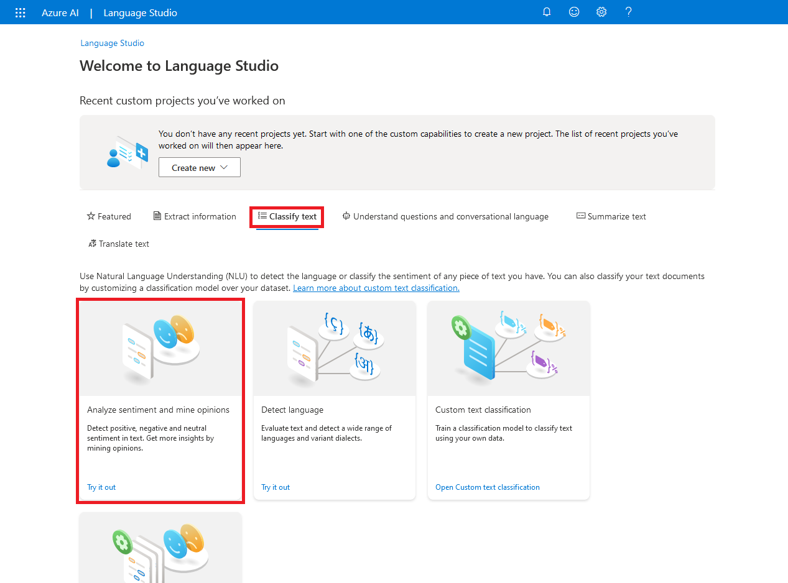
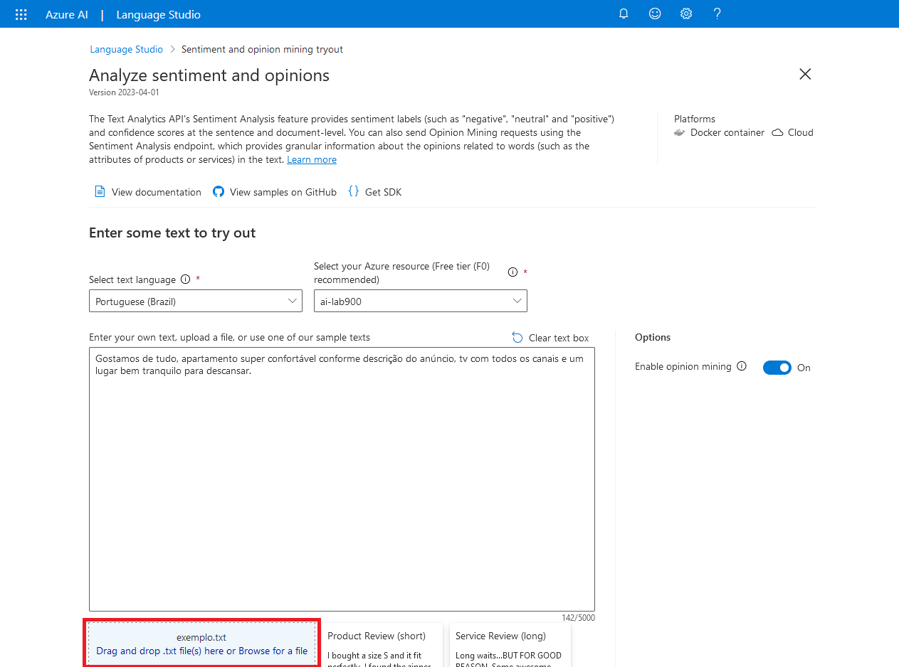
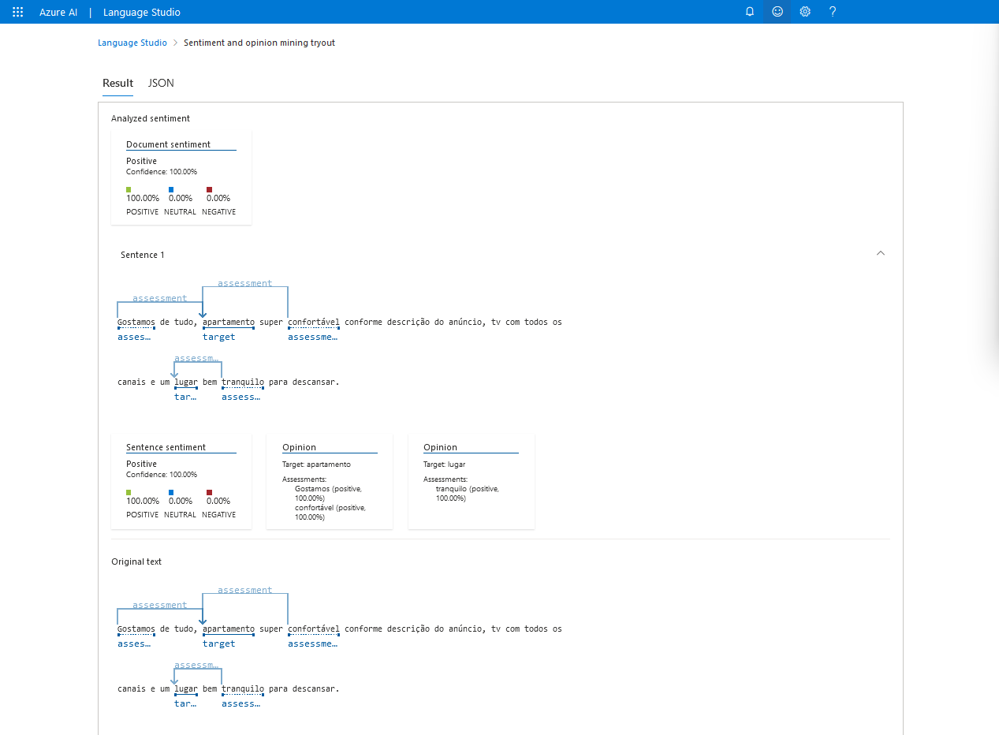

<h1 align="center">  🤖 Análise de Sentimentos com <i>Language Studio</i> no Azure AI </h1>

 

Neste desafio, as capacidades do Azure AI Language são exploradas na análise da compreensão de sentimentos de textos opinativos. O serviço Azure AI Language inclui a análise de texto a capacidades de Porcessamento de Linguagem Natural (NLP).

Para usar o Azure AI, você precisa criar um recurso na sua assinatura do Azure. Só assim você poderá usar o estúdio para trabalhar com os serviços fornecidos no Language Studio.

Caso ainda não possua um recurso, siga as etapas do tópico [**Crie um recurso do Azure AI Language**](#ancora1). Caso contrário, siga para o tópico [**Configure seu recurso no Azure AI Language Studio**](#ancora2).

 

## ✏️ Crie um recurso do Azure AI Language

1. Faça *login* no [Portal Azure](https://portal.azure.com/), usando suas credenciais da Microsoft
2. Selecione **Criar um recurso**, categoria IA + *Machine Learning* e busque por "**Análise de Texto**".
3. Selecione **Continue to create your resource**
4. Na página Create Language, use as seguintes configurações:

    * **Assinatura** => *sua assinatura do Azure*
    * **Grupo de recursos** => *crie ou selecione um grupo de recursos*
    * **Região** => *selecione a região geográfica mais próxima*
    * **Nome** => *insira um nome exclusivo para o seu serviço*
    * **Tipo de preço** => Free F0
    * **Ao marcar essa caixa, declaro que analisei e confirmo os termos no Aviso de Uso Responsável da IA** => *selecione*

4. Selecione **Examinar + criar** e, em seguida, selecione **Criar**.

 

## ✏️ Configure seu recurso no Azure AI Language Studio

1. Navegue até o [Language Studio](https://language.cognitive.azure.com) e conecte-se usando as suas credenciais da Microsoft.

2. Na janela **Select an Azure resource**, insira as seguintes configurações:

    * **Azure directory**: Diretório padrão
    * **Azure subscription**: *selecione a assinatura que você está usando*
    * **Resource type**: Language
    * **Resource name**: *selecione o recurso de linguagem criado*

3. Selecione **Done**

 

## ✏️ Analise revisões no Language Studio

1. Na página inicial do Language Studio, clique na aba **Classify text** e selecione o cartão **Analyze sentiment and mine opinions**.
    

2. Selecione *Portuguese (Brazil)* em **Select text language**.

3. Selecione seu recurso em **Select your Azure resource**

4. Faça *upload* do texto a ser analisado em **Drag and drop .txt file(s) here or Browse for a file** ou insira o texto em **Enter your own text, upload a file, or use one of our sample texts**
    

5. Selecione a opção **I acknowledge that running this demo will incur usage and may incur costs to my Azure resource**
    

## 🧹 Limpeza

O serviço Web que você criou está hospedado em uma instância de contêiner do Azure. Se você não pretende reutilizá-lo, você deve excluí-lo para evitar o acúmulo de uso desnecessário do Azure.

1. Abra o Portal Azure, selecione o grupo de serviços que contém o recurso criado anteriormente. Em seguida, selecione **Delete** e confirme que você deseja excluir o recurso.

 

## 💭 Considerações

O serviço possibilita analisar o sentimento dos clientes de maneira ágil e simples, o que permite avaliar com maior rapidez a opinião sobre os produtos ofertados e, caso necessário, modificar estratégias que não foram bem avaliadas.

 

## 📝 Documentação

* [Analyze text with Language Studio](https://microsoftlearning.github.io/mslearn-ai-fundamentals/Instructions/Labs/06-text-analysis.html)