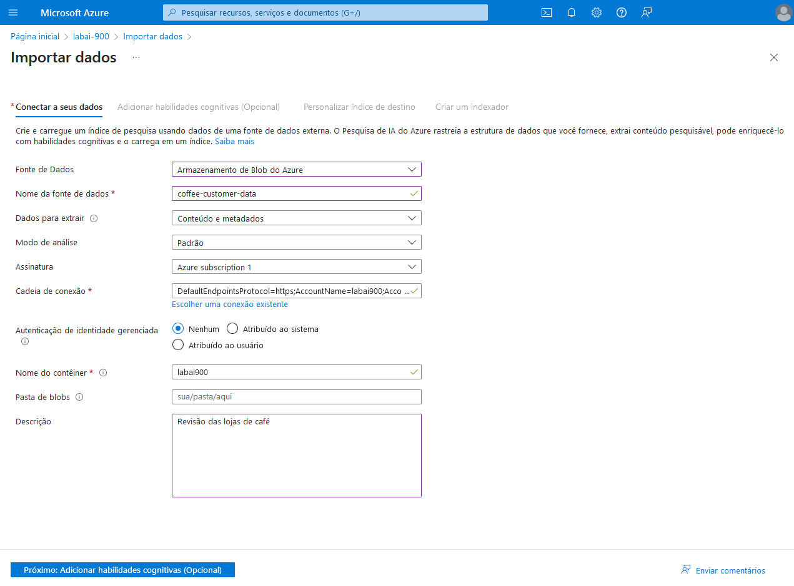
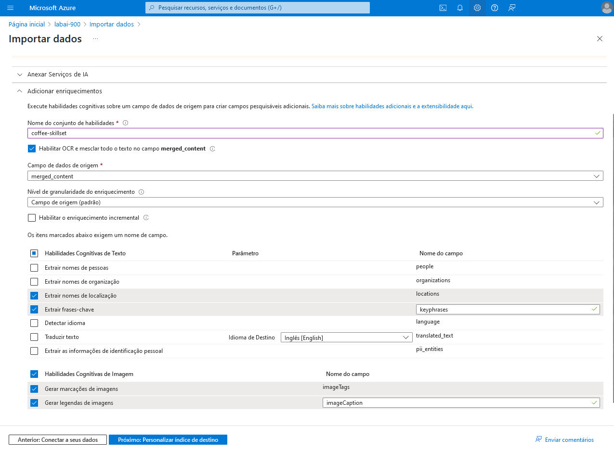
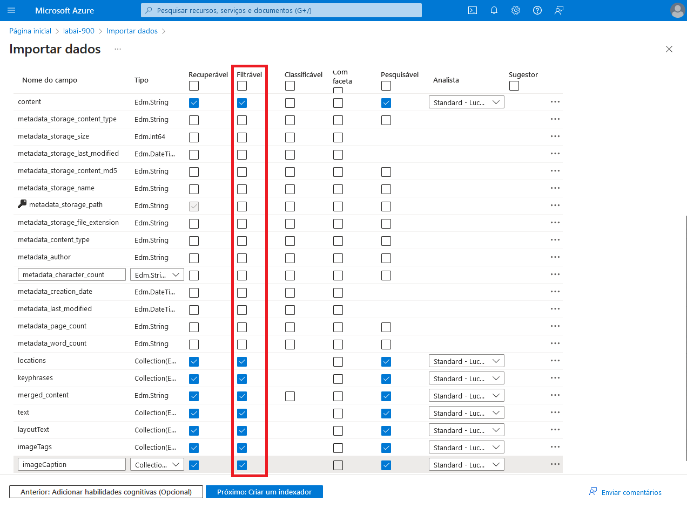
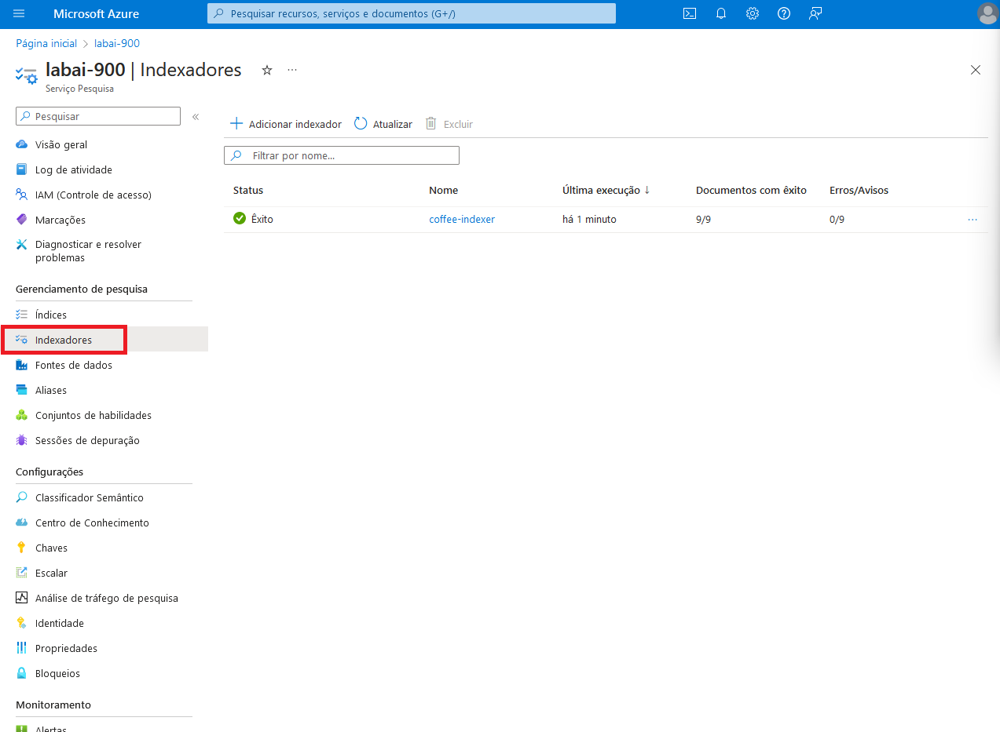
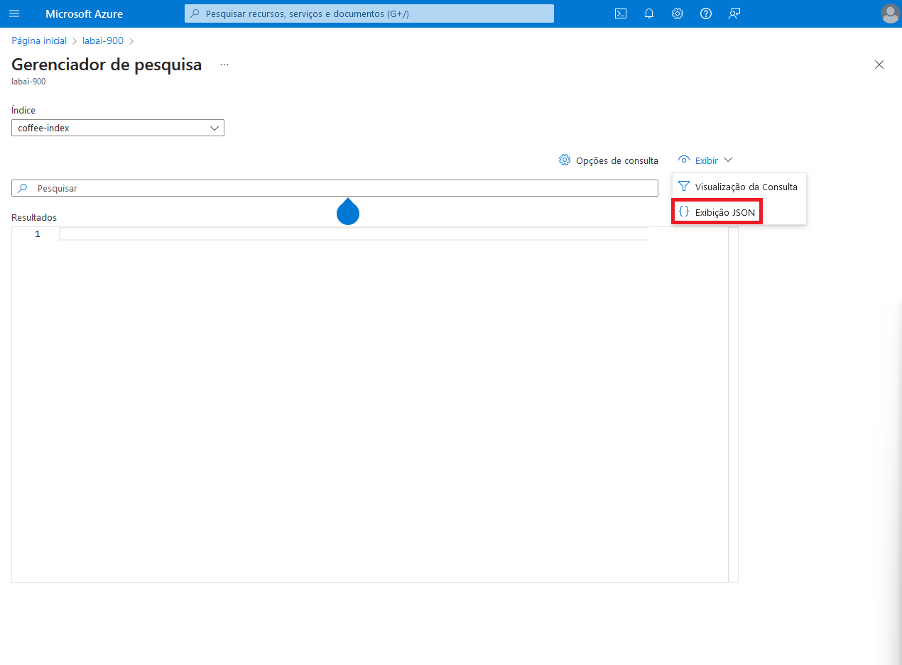
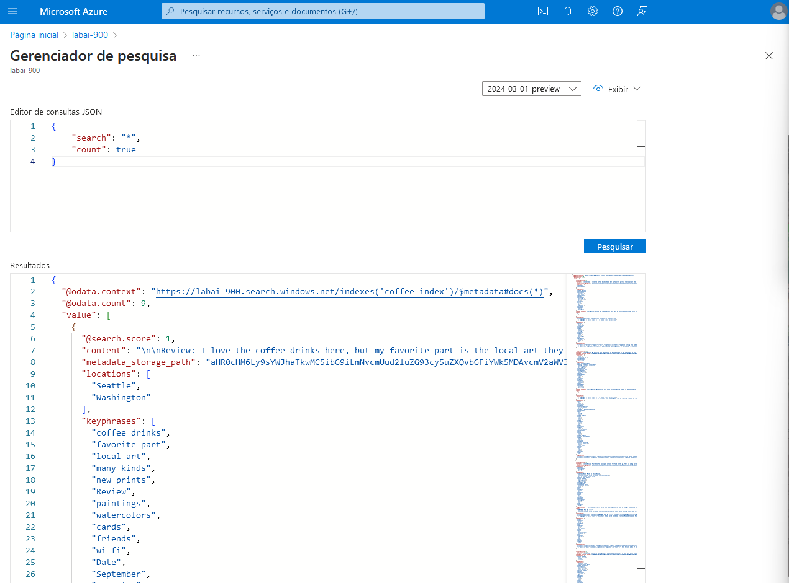
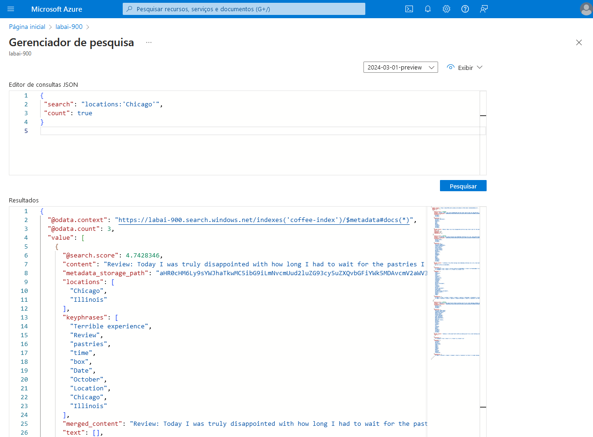

<h1 align="center">  🤖 Explorando os Recursos de IA Generativa com Copilot e OpenAI </h1>

<br>

Neste desafio, o Azure AI Search Index (UI) é utilizado para construir uma solução de mineração de conhecimento que facilita a busca de *insights* sobre as experiências do usuário.

Para usar o Azure AI, você precisa criar um recurso na sua assinatura do Azure. Só assim você poderá usar o estúdio para trabalhar com os serviços fornecidos no Language Studio.

Caso ainda não possua um recurso, siga as etapas do tópico [**Crie um recurso do Azure AI Search**](#ancora1). Caso contrário, siga para o tópico [**Crie um recurso Azure AI Service**](#ancora2).

<br>

<a id="ancora1"></a>
## ✏️ Crie um recurso do Azure AI Search

1. Faça *login* no [Portal Azure](https://portal.azure.com/), usando suas credenciais da Microsoft

2. Selecione **Criar um recurso**, categoria IA + *Machine Learning* e busque por "**Pesquisa de IA**".

3. Selecione **Continue to create your resource**

4. Na página Create Language, use as seguintes configurações:

    * **Assinatura** => *sua assinatura do Azure*
    * **Grupo de recursos** => *crie ou selecione um grupo de recursos*
    * **Nome do serviço** => *insira um nome exclusivo para o seu serviço*
    * **Local** => *selecione a região geográfica mais próxima*
    * **Camadas de preços** => Gratuito

5. Selecione **Examinar + criar** e, em seguida, selecione **Criar**.

<br>

<a id="ancora2"></a>
## ✏️ Crie um recurso Azure AI Service

1. Navegue até o [Portal Azure](https://portal.azure.com/).

2. Selecione **Criar um recurso**, categoria IA + *Machine Learning* e busque por "**Recursos cognitivos**".

3. Na janela **Criar serviços cognitivos**, insira as seguintes configurações:

    * **Assinatura**: *selecione a assinatura que você está usando*
    * **Grupo de recursos**: *selecione o grupo de recursos criado anteriormente*
    * **Região**: *selecione a região geográfica mais próxima*
    * **Nome**: *insira um nome exclusivo para o seu serviço*
    * **Tipo de preço**: Standard S0
    * **Ao marcar essa caixa, confirmo que li e compreendi todos os termos abaixo** => *selecione*

4. Selecione **Examinar + criar** e, em seguida, selecione **Criar**.

<br>

## ✏️ Crie uma conta de armazenamento

1. Navegue até o [Portal Azure](https://portal.azure.com/).

2. Selecione **Contas de armazenamento** e clique em **Criar**.

3. Na janela **Criar uma conta de armazenamento**, insira as seguintes configurações:

    * **Assinatura**: *selecione a assinatura que você está usando*
    * **Grupo de recursos**: *selecione o grupo de recursos criado anteriormente*
    * **Nome da conta de armazenamento**: *insira um nome exclusivo para o seu serviço*
    * **Região**: *selecione a região geográfica mais próxima*
    * **Desempenho**: Standard
    * **Redundância**: LRS (armazenamento com redundância local)

4. Selecione **Examinar + criar** e, em seguida, selecione **Criar**.

5. Na conta de armazenamento criada, selecione **Configuração** no painel à esquerda.

6. Modifique **Permitir acesso anônimo ao Blob** para *Habilitado* e salve.

<br>

## ✏️ Crie contêiner para os arquivos

1. No painel à esquerda da conta de armazenamento, selecione **Contêineres**.

2. Selecione **Contêiner**.

3. Insira as seguintes configurações no painel à direita e clique em **Criar**:

    * **Nome**: *insira um nome exclusivo para o seu serviço*
    * **Região**: *selecione a região geográfica mais próxima*
    * **Nível de acesso anônimo**: Contêiner (acesso de leitura anônimo para contêineres e blobs)
    * **Avançado** => *não modifique*

4. Na página do contêiner criado, faça o upload dos arquivos deste [link](https://aka.ms/mslearn-coffee-reviews).

<br>

## ✏️ Indexação dos documentos

1. No portal Azure, navegue até o recurso do Azure AI Search criado.

2. Selecione **Importar dados**.

3. Na página **Importar dados**, na lista **fonte de dados**, selecione **Armazenamento de Blob do Azure**.

4. Insira as seguintes informações e clique em **Criar**:

    * **Nome da fonte de dados**: *insira um nome exclusivo para o seu serviço*
    * **Dados para extrair**: Conteúdo e metadados
    * **Modo de análise**: Padrão
    * **Assinatura**: *selecione a assinatura que você está usando*
    * **Cadeia de conexão** => *clique em **Escolher uma conexão existente**, selecione sua conta de armazenamento, selecione o contêiner e clique em **Selecionar***
    * **Autenticação de identidade gerenciada**: Nenhum
    * **Nome do contêiner**: *é preenhido automaticamente*
    * **Pasta de blobs** => *deixe em branco*
    * **Descrição**: *insira uma descrição* 

    

5. Selecione **Próximo: adicione habilidades cognitivas (opcional)**.

6. Na aba **Adicionar habilidades cognitivas (opcional)**, anexe o serviço de IA ou não modifique caso seja gratuito.

7. Na seção **Adicionar enriquecimentos**:

    * modifique o **Nome do conjunto de habilidades**
    * selecione **Habilitar OCR e mesclar todo o texto no campo merged_content**
    * certifique-se que o **Campo de dados de origem** é merged_content
    * não selecione **Habilitar o enriquecimento incremental**
    * selecione as seguintes habilidades:
        * **Extrair nomes de localização**
        * **Extrair frases-chave**
        * **Gerar marcações de imagens**
        * **Gerar legendas de imagens**

    

8. Na seção **Salvar os enriquecimento em um repositório de conhecimento**, escolhe uma conexão existente em **Cadeia de conexão da conta de armazenamento**, como explicado anteriormente, e selecione:

    * **Projeções de imagem**
    * **Documentos**: Frases-chave, Entidades, Detalhes da imagem, Referências de imagem
    * **Projeços de blob do Azure**: Documento
    * **Nome do contêiner** => *não modifique*

9. Clique em **Próximo: Personalizar índice de destino**.

10. Modifique o nome do índice e assegure-se de que a chave é **metadata_storage_path**.

11. Marque **Filtrável** para todos os campos selecionados por padrão.

    

12. 9. Clique em **Próximo: Criar um indexador**.

13. Modifique o nome do indexador e marque a agenda para **Uma vez**.

14. Em opções avançadas, selecione **Chaves de codificação de base 64** e clique em **Enviar**. O *status* pode ser verificado em **Indexadores**, no painel à esquerda da página do serviço de pesquisa criado.

    

<br>

## ✏️ Consultar o índice

1. Utilize o **Search Explorer** para escrever e testar consultas. Na visão geral do serviço de pesquisa, selecione **Gerenciador de pesquisa**

2. Selecione **Exibição JSON** em **Exibir**.



3. No **Editor de consultas JSON**, insira o texto abaixo e clique em **Pesquisar**.
```
{
    "search": "*",
    "count": true
}
```



4. Adicione o seguinte filtro para localidade:
```
{
    "search": "locations:'Chicago'",
    "count": true
}
```



<br>

## 🧹 Limpeza

O serviço Web que você criou está hospedado em uma instância de contêiner do Azure. Se você não pretende reutilizá-lo, você deve excluí-lo para evitar o acúmulo de uso desnecessário do Azure.

1. Abra o Portal Azure, selecione o grupo de serviços que contém o recurso criado anteriormente. Em seguida, selecione **Delete** e confirme que você deseja excluir o recurso.

<br>

## 📝 Documentação

* [Explore an Azure AI Search index (UI)](https://microsoftlearning.github.io/mslearn-ai-fundamentals/Instructions/Labs/11-ai-search.html)