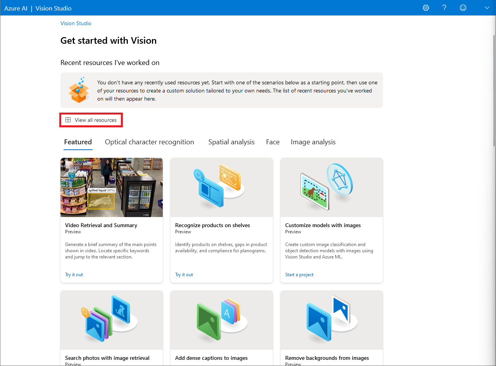
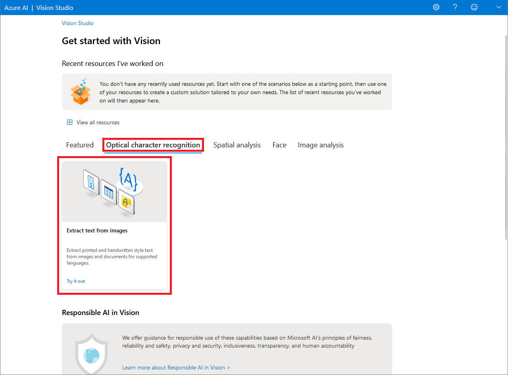
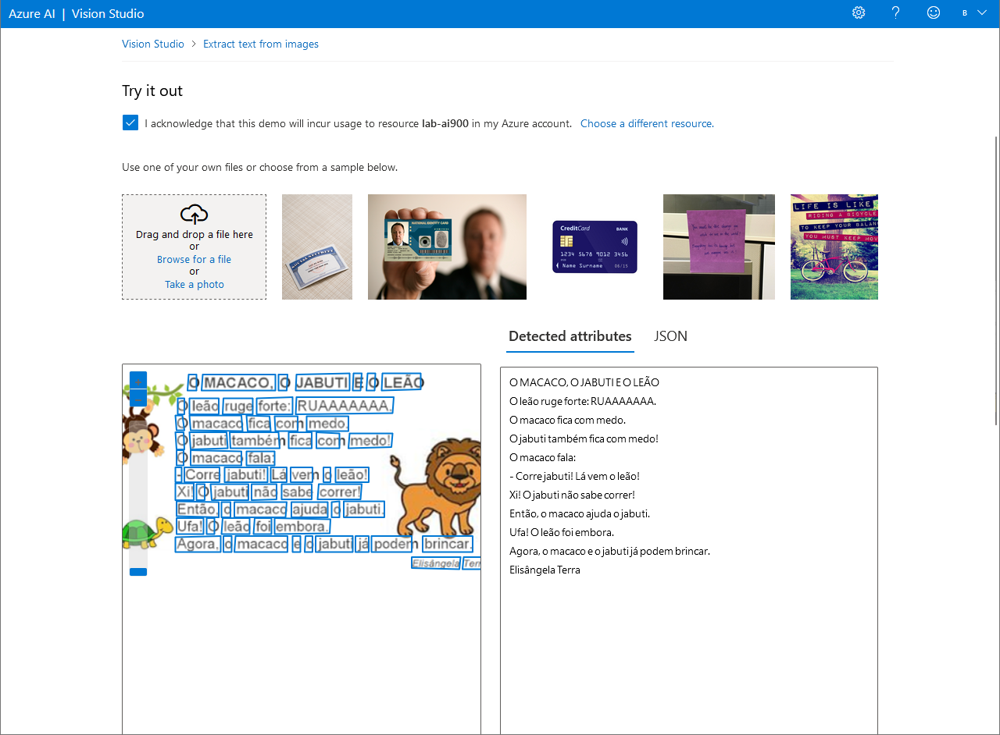

<h1 align="center">  🤖 Explorando os Recursos de IA Generativa </h1>

 

Neste desafio, o recurso Vision Studio da Azure AI foi utilizado para detectar textos em imagens.

Para usar o Azure AI, você precisa criar um recurso na sua assinatura do Azure. Só assim você poderá usar o estúdio para trabalhar com os serviços fornecidos no Language Studio.

Caso ainda não possua um recurso, siga as etapas do tópico [**Crie um recurso do Azure AI *Services***](#ancora1). Caso contrário, siga para o tópico [**Conecte seu recurso Azure AI *Service* ao Vision Studio**](#ancora2).

 

## ✏️ Crie um recurso do Azure AI *Services*

1. Faça *login* no [Portal Azure](https://portal.azure.com/), usando suas credenciais da Microsoft
2. Selecione **Criar um recurso**, categoria IA + *Machine Learning* e busque por "**Serviços Cognitivos**".
3. Crie um novo recurso do Azure com as seguintes configurações:

    * **Assinatura** => *sua assinatura do Azure*
    * **Grupo de recursos** => *crie ou selecione um grupo de recursos*
    * **Região** => *selecione a região geográfica mais próxima*
    * **Nome** => *insira um nome exclusivo para o seu serviço*
    * **Tipo de preço** => Standard S0
    * **Ao marcar essa caixa, confirmo que li e compreendi todos os termos abaixo** => *selecione*

4. Selecione **Examinar + criar** e, em seguida, selecione **Criar**.

 

## ✏️ Conecte seu recurso Azure AI Service ao Vision Studio

1. Navegue até o [Vision Studio](https://portal.vision.cognitive.azure.com) e conecte-se usando as suas credenciais da Microsoft.

2. Na página inicial do Vision Studio, clique em **View all resources**

    

3. Em **Select a resource to work with**, selecione o serviço criado anteriormente e clique em **Select as default resource**
4. Feche a página ao clicar no "x" no canto superior direito.

 

## ✏️ Leia texto no Vision Studio

1. Na página inicial do Vision Studio, clique na aba **Optical character recognition** e selecione o cartão **Extract text from images**.
    

2. Sob o subtítulo **Try It Out**, leia e aceite a política de uso de recursos.

3. Selecione cada uma das imagens amostras e observe os dados de detecção de rosto que são retornados.

4. Você também pode tentar com algumas de suas próprias imagens. Basta fazer o *upload* da imagem em **Browse for a file**. Veja um exemplo:
    

 

## 🧹 Limpeza

O serviço Web que você criou está hospedado em uma instância de contêiner do Azure. Se você não pretende reutilizá-lo, você deve excluí-lo para evitar o acúmulo de uso desnecessário do Azure.

1. Abra o Portal Azure, selecione o grupo de serviços que contém o recurso criado anteriormente. Em seguida, selecione **Delete** e confirme que você deseja excluir o recurso.

 

## 📝 Documentação

* [Explore generative AI with Microsoft Copilot](https://microsoftlearning.github.io/mslearn-ai-fundamentals/Instructions/Labs/12-generative-ai.html)
* [Explore Azure OpenAI](https://microsoftlearning.github.io/mslearn-ai-fundamentals/Instructions/Labs/13-azure-openai.html)
* [Explore content filters in Azure OpenAI](https://microsoftlearning.github.io/mslearn-ai-fundamentals/Instructions/Labs/14-azure-openai-content-filters.html)